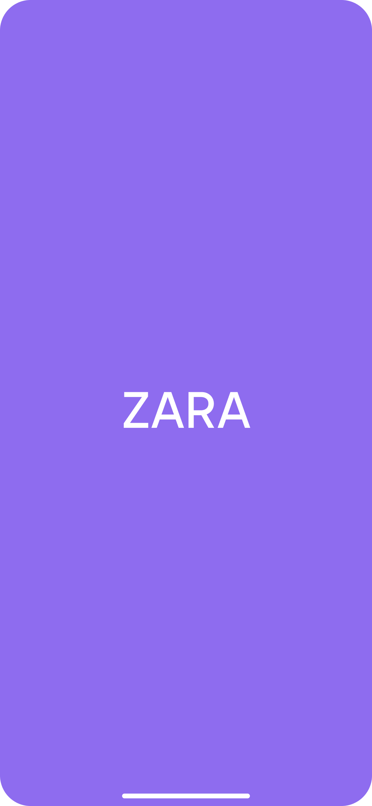
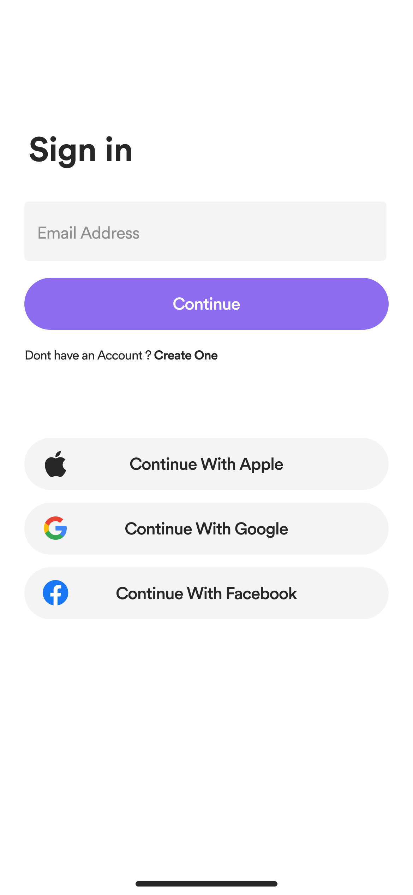
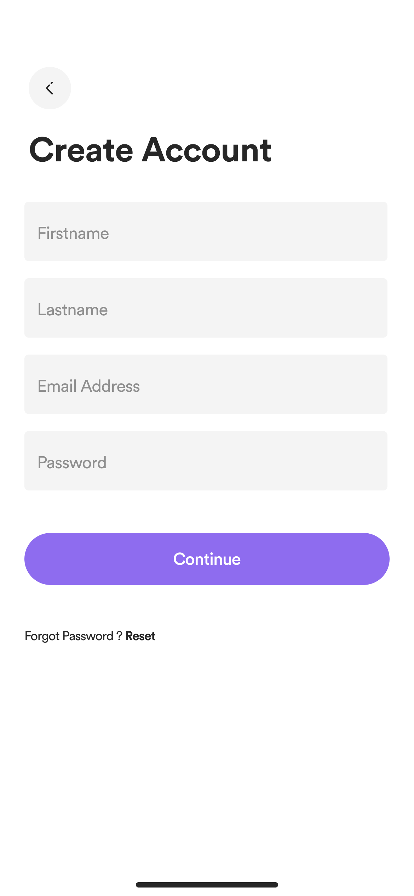
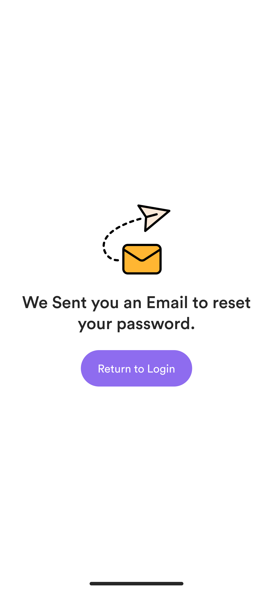
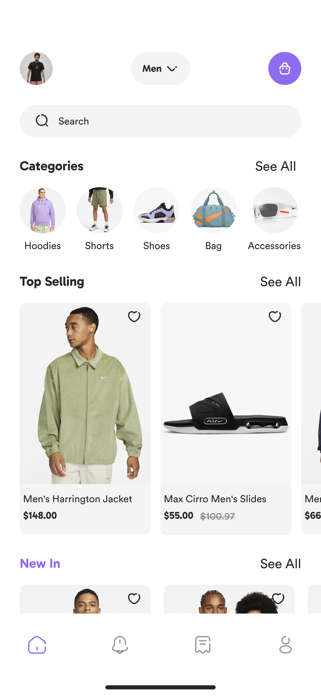
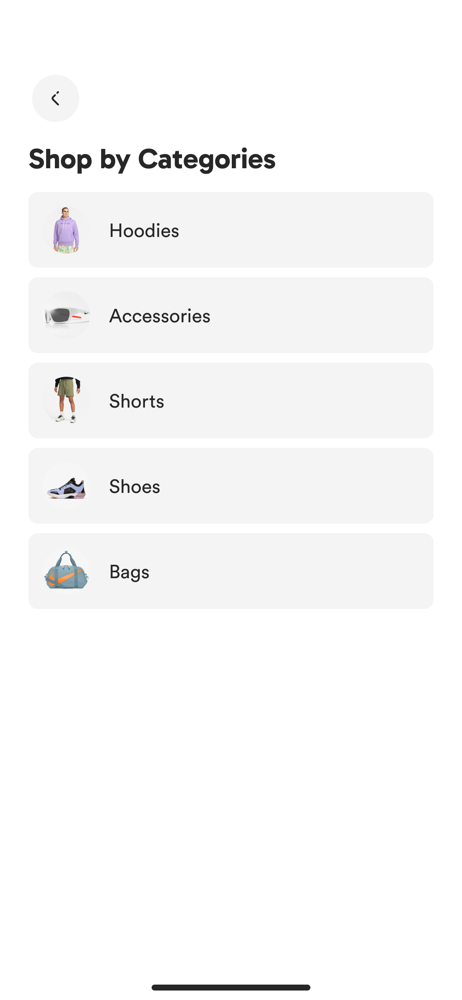
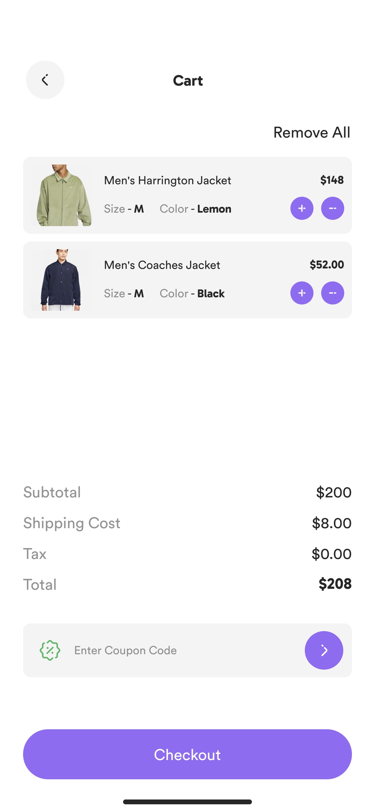
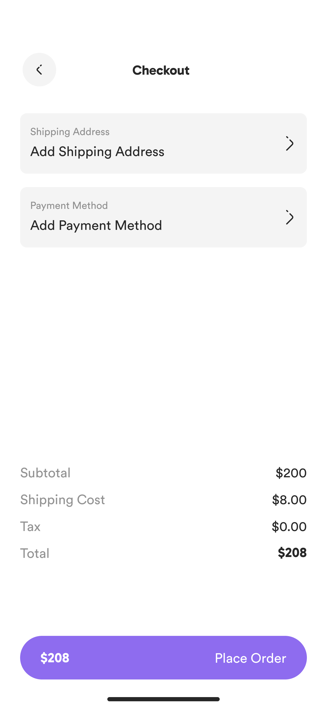
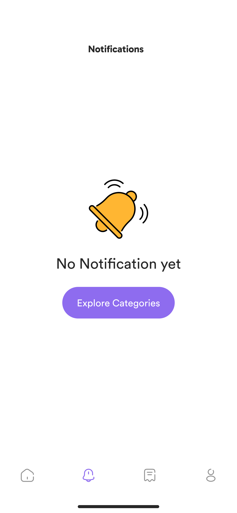
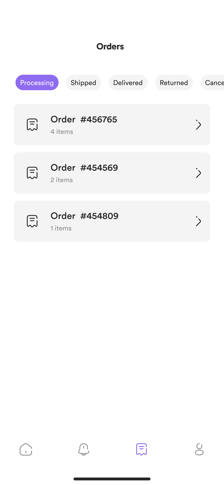

# ZARA App — Flutter UI Clone

A pixel-perfect, fully responsive **Zara e-commerce UI** built with Flutter, inspired by the official Zara mobile experience. This project covers the complete shopping journey — from onboarding to order tracking.

---

##  Screenshots

###  Login & Onboarding
  



Sign In, Sign Up, Forgot Password, Email Verification, Tell Us About Yourself

---

###  Homepage
  

Category browsing, Top Selling & New In sections, search bar with Hero animation

---

###  Product Page
 


Product detail, color & size selectors, shipping info, reviews

---

###  Cart & Checkout
  

Add to cart, multi-step checkout, order placed success screen

---

###  Search & Filter
 


Live search, filter by Sort, Gender, Size, Price

---

###  Notifications & Orders
  

Notifications, orders list, order detail, shipment tracking
---

##  Features

-  **Authentication Flow** — Sign In, Sign Up, Forgot Password, Email Verification, Tell Us About Yourself
-  **Homepage** — Category browsing, Top Selling & New In sections, search bar with Hero animation
-  **Product Page** — Image display, color & size selectors, shipping info, reviews
-  **Cart & Checkout** — Add to cart, multi-step checkout, order placed success screen
-  **Search & Filter** — Live search, filter by Sort, Gender, Size, Price
-  **Notifications** — Empty state and notification list
-  **Orders** — Empty state, orders list, order detail, shipment tracking
-  **Settings** — Profile settings, wishlist

---

##  Project Structure

```
lib/
├── core/
│   ├── constants/        # App assets, fonts, strings
│   ├── functions/        # Helper functions (push_to, etc.)
│   └── styles/           # App colors, themes
└── features/
    ├── home/             # Homepage (pages, widgets, data)
    ├── hoodies/          # Category product grid
    ├── product/          # Product detail page
    ├── search&filter/    # Search and filter pages
    ├── notifications/    # Notifications page
    ├── category/         # Category screen
    ├── main/             # Main app screen (bottom nav)
    └── settingwidgt/     # Settings widgets
```

---

##  Tech Stack

| Technology | Usage |
|---|---|
| **Flutter** | UI Framework |
| **Dart** | Programming Language |
| **flutter_svg** | SVG icon rendering |
| **Hero Animations** | Shared element transitions |
| **GridView.builder** | Dynamic product grids |
| **Custom Widgets** | Reusable card, form, label components |

---

##  Getting Started

### Prerequisites
- Flutter SDK `>=3.0.0`
- Dart SDK `>=3.0.0`
- Android Studio / VS Code

### Installation

```bash
# Clone the repository
git clone https://github.com/Abdoae35/zara_app

# Navigate to the project
cd zara_app

# Install dependencies
flutter pub get

# Run the app
flutter run
```

---

##  Dependencies

```yaml
dependencies:
  flutter:
    sdk: flutter
  flutter_svg: ^2.0.0
```

---

##  Design

UI Design created in **Figma**, following Zara's brand identity:
- **Primary Color:** Purple `#7C3AED`
- **Background:** White / Light Grey
- **Typography:** Gabarito, system fonts
- **Design Style:** Minimal, clean, high-end fashion aesthetic

---

##  Assets

```
assets/
├── icons/        # SVG icons (cart, arrow, heart, etc.)
└── images/       # Product images, illustrations
```

---

##  Contributing

Contributions are welcome! Feel free to open an issue or submit a pull request.

1. Fork the project
2. Create your feature branch (`git checkout -b feature/AmazingFeature`)
3. Commit your changes (`git commit -m 'Add some AmazingFeature'`)
4. Push to the branch (`git push origin feature/AmazingFeature`)
5. Open a Pull Request

---
